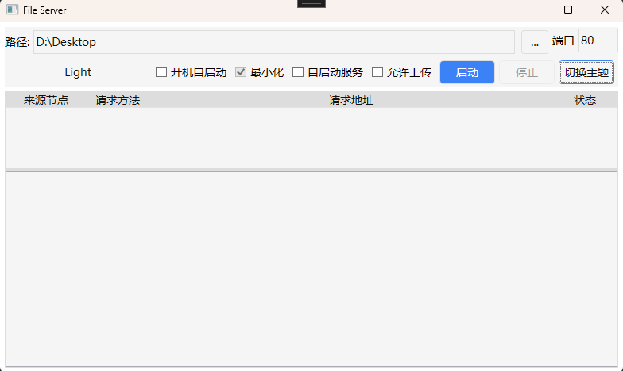
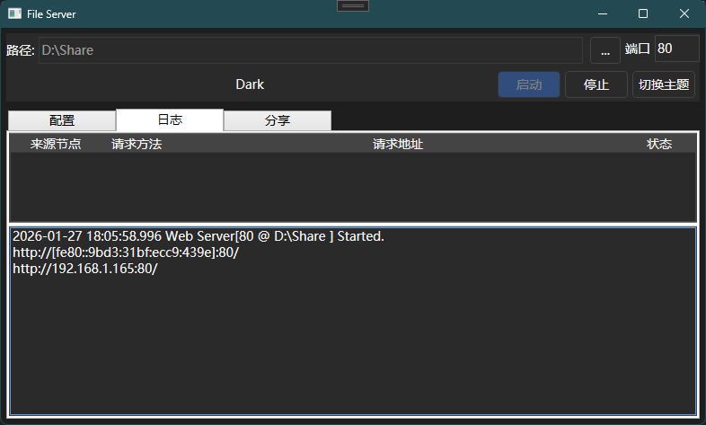
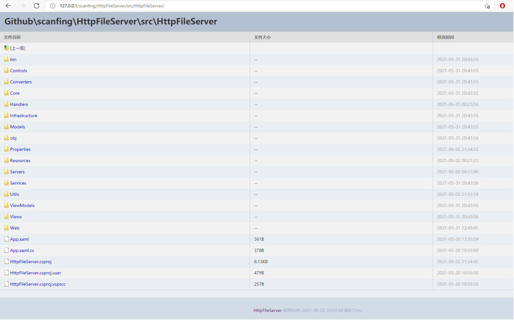
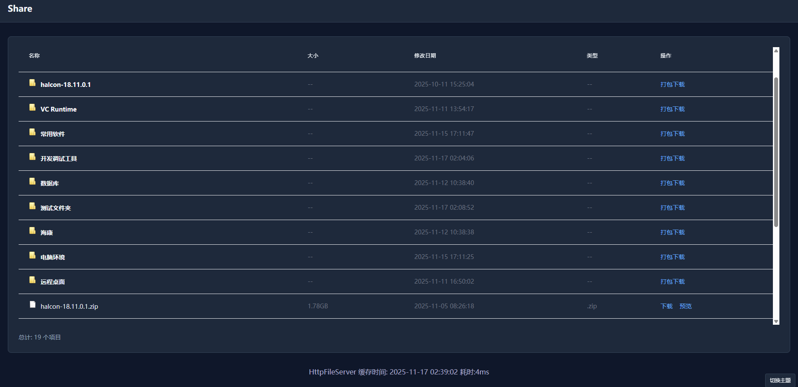
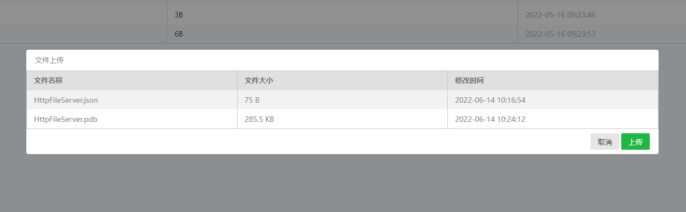
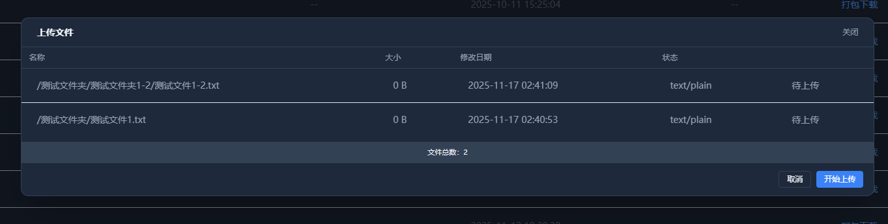
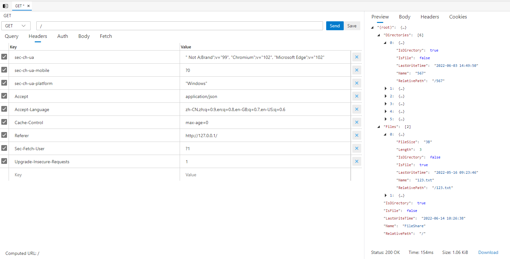

# HttpFileServer

http文件服务器 可用于局域网内目录浏览和文件下载、上传、图片预览、打包下载zip等功能

http server for browse directory and download / upload files

支持将目录信息响应为json格式(发起HTTP请求时将Header中的Accept设置为application/json)

## PS

部分后端代码来自 [Prism](https://github.com/PrismLibrary/Prism) & [.Net Reference Source](https://referencesource.microsoft.com/)

部分前端资源来自 [Chromium](http://www.chromium.org/Home) & [tailwindcss.3.4.17](https://github.com/tailwindlabs/tailwindcss) & [qrcodejs](https://github.com/KeeeX/qrcodejs)

### 截图

程序界面（浅色）

程序界面（暗色）

网页界面（浅色）

网页界面（暗色）

上传界面（浅色）

上传界面（暗色）

JSON响应

## 主要功能

- 在局域网内托管指定目录，支持目录浏览与文件下载。
- 支持将目录信息以 JSON 返回（当请求 Header 的 Accept 包含 application/json 时）。
- 支持通过浏览器或 API 下载目录为 ZIP（通过查询参数或 Accept 触发）。
- 支持断点续传（Range 请求）。
- 支持文件上传（multipart/form-data），但在默认配置中上传功能是关闭的，可在界面中开启。
- 提供简单的防火墙辅助方法，可以在 Windows 上尝试添加防火墙例外端口或应用程序（程序会调用系统 COM 接口）。

- 支持界面主题（Light / Dark / System）。程序会根据系统主题自动选择，也可在主界面手动切换主题，当前主题会保存到配置中以便下次启动保持。暗色主题的截图已包含在文档中。

## 主要使用说明

- 启动程序后，在主界面可选择要共享的根目录（默认是当前用户的桌面）、监听端口（默认 80），以及是否启用 JSON 响应与上传功能。
- 启动服务器后，程序会在日志中列出本机所有可用 IP 地址（例如： http://192.168.1.5:80/ ），局域网内其他机器可直接访问。

## HTTP 行为与 API

- 目录浏览（HTML）：在浏览器打开目录 URL（例如 `/` 或 `/subdir/`）会返回 HTML 页面以展示目录内容。

- 目录浏览（JSON）：发送请求时将 Accept 设为 `application/json` 会得到 JSON 格式的目录结构响应（默认启用，可在界面关闭）。

- ZIP 下载：可通过两种方式触发下载为 ZIP：
	- 在查询字符串中设置 `download=1` 或 `download=true`，例如：`http://host:port/path?download=1`
	- 将请求的 Accept 设为 `application/zip`。

- 预览（Preview）：通过在 URL 中加入查询参数 `preview=1` 会以原始内容直接返回用于预览，而不触发下载或 ZIP 行为。例如：`http://host:port/path/file.png?preview=1`。

- 断点续传（Range）：支持 HTTP Range 请求头以实现断点续传与分片下载。

- 缓存与 ETag：服务器为目录与文件提供简单的 ETag 与 `Cache-Control: no-cache`，支持 If-None-Match 返回 304（Not Modified）。

- 上传：若在 UI 中启用上传，浏览器端的上传表单会使用 `multipart/form-data` 提交到要上传到的目录路径。也可以使用任意支持 multipart 的 HTTP 客户端直接 POST 文件到目录路径。上传逻辑在接收后会将文件写入对应目录，并在成功后重定向回请求的 URL。

## 默认配置（代码中的初始值）

- EnableJson: true（默认开启 JSON 响应）
- EnableUpload: false（默认关闭上传）
- Port: 80
- RootDir: 当前用户桌面（Environment.SpecialFolder.Desktop）

这些默认值可在程序 UI 中更改；程序会在退出时保存配置。

## 依赖

- 使用了 `Newtonsoft.Json`（用于 JSON 序列化）和 `ICSharpCode.SharpZipLib`（用于打包 ZIP）。依赖已经包含在 `packages/` 目录中，项目文件引用见 `src/HttpFileServer/HttpFileServer.csproj`。

## 注意事项与已知点

- 程序在尝试操作防火墙时需要管理员权限，且不同 Windows 版本与安全策略可能导致添加端口或应用失败；代码对此做了异常吞噬处理（失败时不会抛出到 UI）。

## 构建与运行

- 该项目为 .NET Framework WPF 应用，目标框架为 .NET Framework 4.7.2（详见 csproj）。
- 在 Windows 上打开解决方案 `src/HttpFileServer/HttpFileServer.sln`，使用 Visual Studio 编译并运行（或直接运行 `bin/Debug/HttpFileServer.exe`）。

